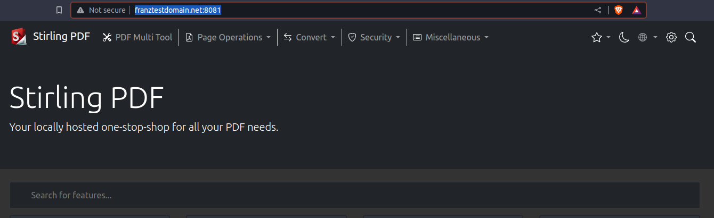

# Readme

## Usage:

change _startup.sh_ into executable by:

```bash
sudo chmod +x ./startup.sh
```

Note: _startup.sh_ is currently not absolutely necessary, it is a setup to intrduce _docker networks_ in the future.

### After Startup

- docker-compose up is called and starts a an nginx in a _docker host network_.
- All other images can be reached by curling their respecive name from **inside the nginx image** like so:
  - ```bash
      curl http://<imageName>:<port>
      # example:
      curl http://s-pdf:8080
    ```
- due to the docker-compose only the nginx-image is a ccessible via published and exposed ports. The others can only be accessed from inside the docker host net.

### Configuring localhost for testing purposes

Configure a test domain to point to localhost. This can be done by adding

```
127.0.0.1      franztestdomain.net
```

to _/etc/host/_.

testing the rereouting:

```
curl http://franztestdomain.net:8081
```

should return valid html.
After **restart** the result is visible in the browser:

